# ej-azure-devops
Azure Devops Repo


[](https://github.com/ejime7/ej-azure-devops/actions/workflows/pythonapp.yml)

# Overview

In this project I will we demostrate how to use Continues Integration and Continuous Delivery together to automate Web Applications Deployments using Azure CloudShell,
Github Actions, Azure Pipelines, and Azure Web App Services, and the final product will be our Flask Web Application. Next, you will find information, instruction and guidance on how to performed this task in the future. 

## Project Plan

* Here's the link for the Trello board of the project
 https://trello.com/invite/b/3LQzmHqV/ATTI76718bf0486d5d2a7e362c2b06f59b1c6ACDB8FC/azuredevops-cloud-engineer-board
* A link to a spreadsheet that includes the original and final project plan>

## Instructions
<TODO:  Instructions for running the Python project.  How could a user with no context run this project without asking you for any help.  Include screenshots with explicit steps to create that work. Be sure to at least include the following screenshots:

## Continuous Integration
## Project cloned into Azure Cloud Shell using SSH Keys
*(In order to clone the repository into the Cloud Shell , Please follow the steps below;)*
 >First you need to create a github repository.
 * Create a new repository
 	* Add a repository name
 	* Private Repository
 	* Add a README file
 	* Add .gitignore template Python
 	* License None
 	* Grant your Marketplace apps access to this repository : Azure Pipelines
 	* Create Repository

 
 
 >Then, you need to create an ssh key
 ```
 Open the Azure Cloud Shell Terminal and then follow the commands below,
 
 ssh-keygen -t rsa
 cat /home/user/.ssh/id_rsa.pub
 ```
 
 
 >Copy that ssh key into your Github account (go to  **Settings, SSH and GPG Keys, New SSH Key** )
  * Add a Tittle
  * Key Type ( Authentication Key )
  * Key ( will be the one that you copy from the Azure Cloud Shell using the cat command )
  
 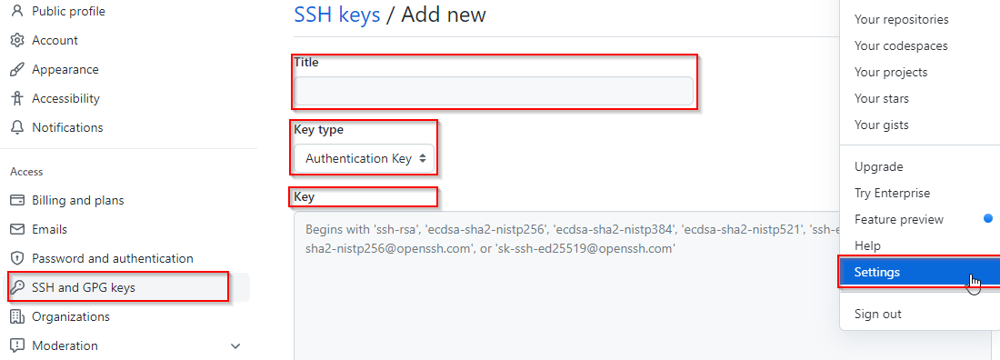
  
  * Now, Open the Azure Cloud Shell Terminal, and type the following;
 ```
 git clone git@github.com:ejime7/ej-azure-devops.git

 ```   
   
   

## Passing tests results after running the `make all` command from the `Makefile`
>First, create a file a named *MakeFile*,
* Open the Azure Cloud Shell Terminal and type the touch cmd to create a Makefile.
```
cd ej-azure-devops
touch Makefile
```
* Add the commands below into the Makefile and save it.
```
install:
	pip install --upgrade pip &&\
		pip install -r requirements.txt
lint:
	pylint --disable=R,C hello.py
test:
	python -m pytest -vv test_hello.py
all: install    lint    test
```   
* Example: How to save the file using the Azure Cloud Shell
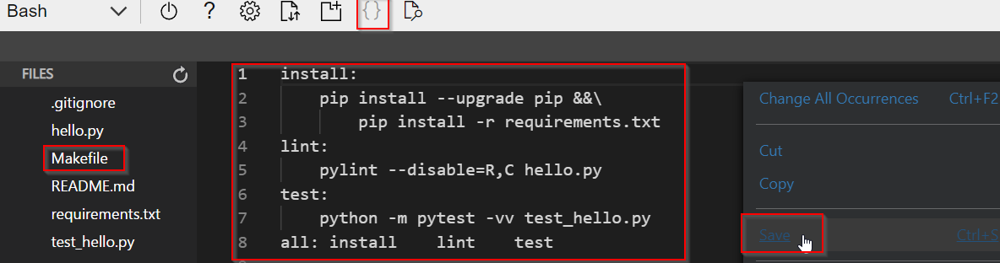
* Create a requirements.txt file and the following items below.
```
pylint
pytest
```
* Create the Python Virtual Environment for our application, and Test the application using Make all command.
```
python3 -m venv ~/.myenv
source ~/.myenv/bin/activate
make all
```    


## Output of a test run using Github Actions
> First, we need to enable GitHub Actions. Go to Actions, Setup a Workflow for yourself, and create a .yml file.
* Example:

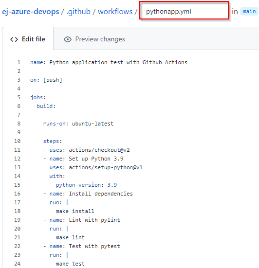
> This workflow will be triggered and will use the .yml file created to test your application in our Remote. This will ensure that the 
applications passed all the test needed to be deploy into Azure.
* Results / Passed


## Continuous Delivery
## Project running on Azure App Service
Since we finished with the CI part, now we are going to integrate the Continuos Delivery using the same repo, but you will need to add some additional files that are listed in this repo in order to be able to create an push our applicatin via the azure cloud shell.
Type the following command to pull the latest changes from your github repo.
```
(.myenv) emanuel [ ~/ej-azure-devops ]$ git pull
```
Now, let assign executable permission to the following files " make_predict_azure_app.sh ", "make_prediction.sh"
```
(.myenv) emanuel [ ~/ej-azure-devops ]$ chmod +x make_prediction.sh
(.myenv) emanuel [ ~/ej-azure-devops ]$ chmod +x make_predict_azure_app.sh
```
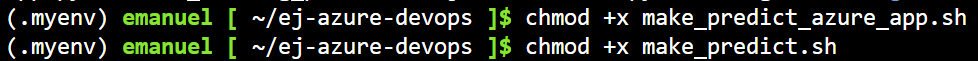
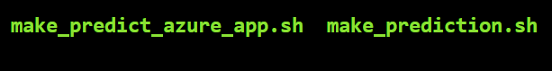


Notes: Make sure that you are in this location in the azure cloud shell, and run make install
Example:
```
(.myenv) emanuel [ ~/ej-azure-devops ]$ make install
```

```
(.myenv) emanuel [ ~/ej-azure-devops ]$ az webapp up --name ej-cicdapp --resource-group EJ-Devops
```
* After complete the previous command, these are the results.
>Example
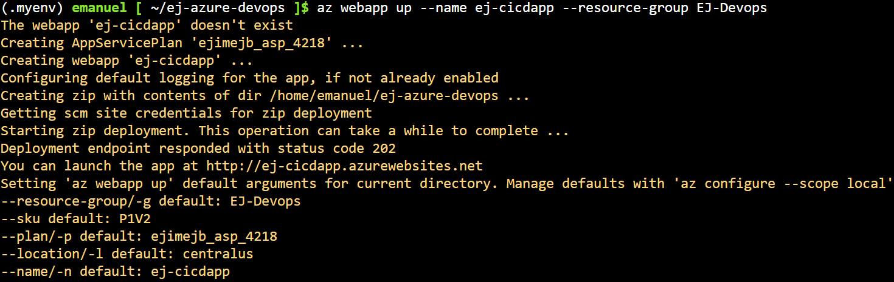
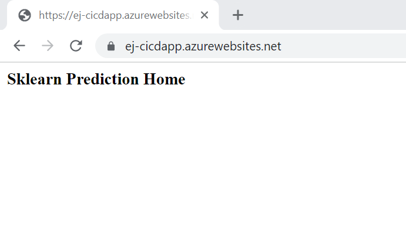

Results:
```
(.myenv) emanuel [ ~/ej-azure-devops ]$ ./make_predict_azure_app.sh
Port: 443
{"prediction":[20.35373177134412]}
```

## Successful deploy of the project in Azure Pipelines. 
* Here are the steps to create a project
     * Go to https://dev.azure.com/  
     * Create a new project with the following options.
     * Private Project
     * Advance Options Version Control ( Git, Basic )
* Create a new service connection
     * Go to Project Settings
     * Service Connections
     * Create a service connection
     * Select Azure Resource Manager / Authentication Method : Service Principal Automatic
* Results

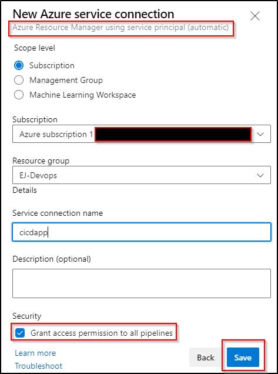
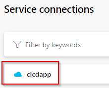
  
## Running Azure App Service from Azure Pipelines automatic deployment
* Go to Pipelines in the new project
     * Create a new pipeline
     * Select your Github Repository
     * Select Python to Linux WebApp on Azure
     * Select an Azure subscription
     * Confirm the creation of a new .yml file in your repository
     * Pick your WebApp Name
     * Review your Pipeline .yml file , and click save and run.
* Results

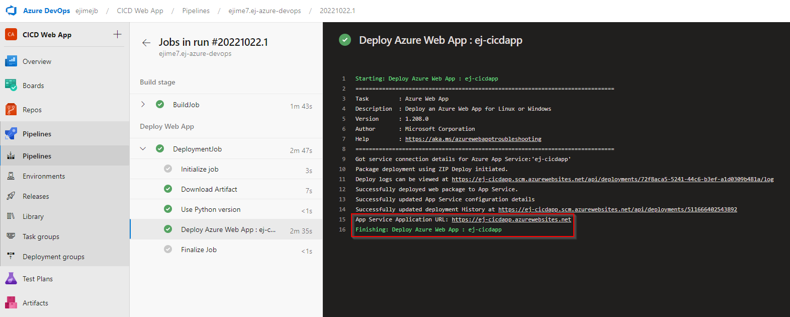

* Output of streamed log files from deployed application

* Output result of a Load Test using Locust.
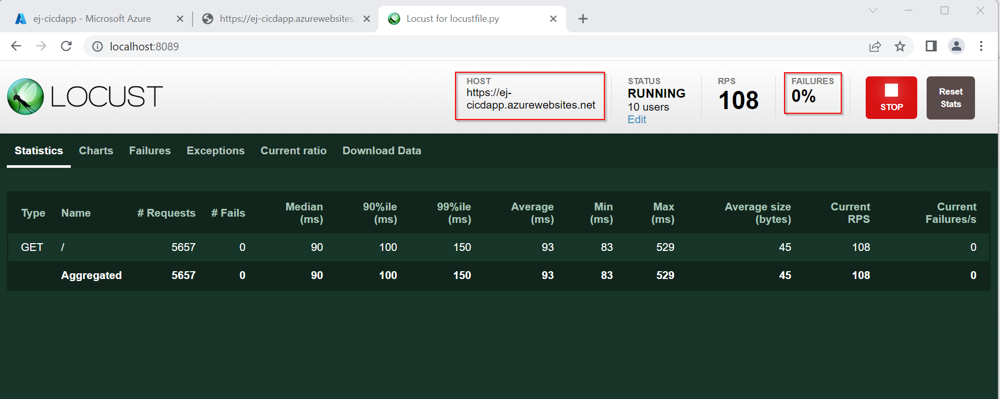

## Enhancements

For future Enhancements , I will recommeded you to update the modules and python packages. This will keep your Flask application up to date and secure.  

## Demo 

<TODO: Add link Screencast on YouTube>

