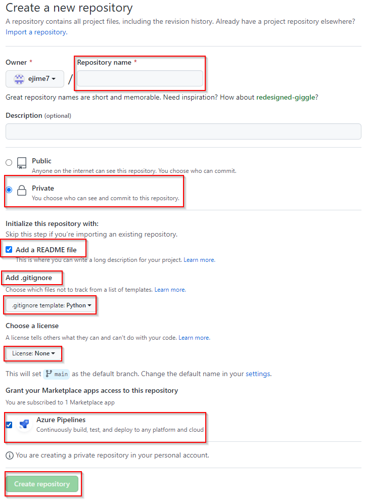
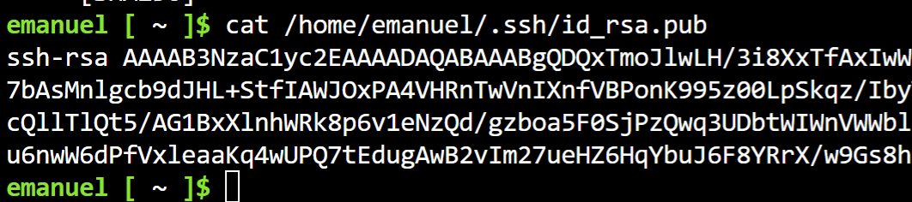
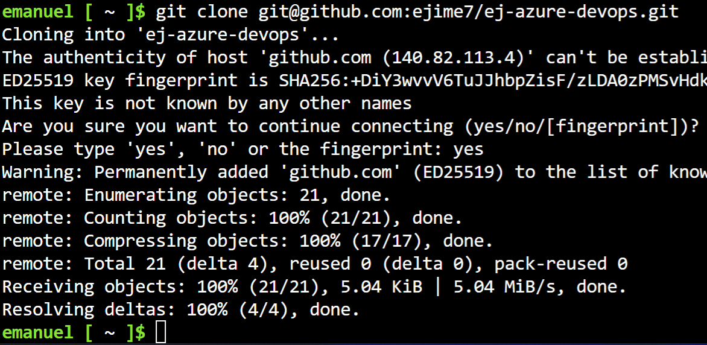
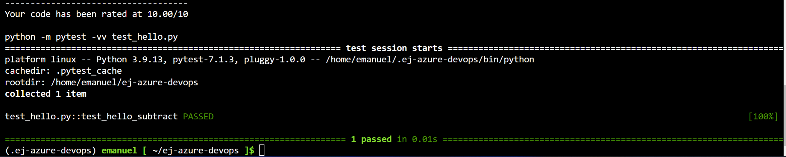
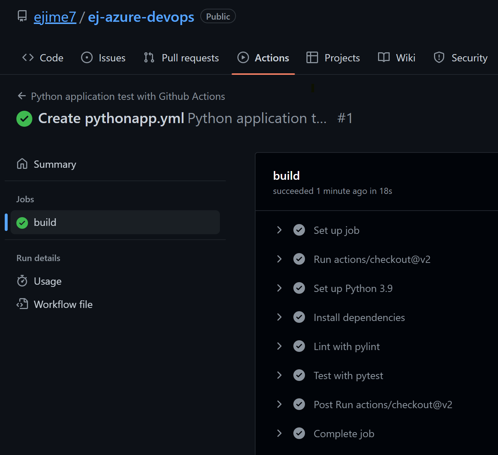

# ej-azure-devops
Azure Devops Repo


[](https://github.com/ejime7/ej-azure-devops/actions/workflows/pythonapp.yml)

# Overview

In this project I will we demostrate how to use Continues Integration and Continuous Delivery together to automate Web Applications Deployments using Azure CloudShell,
Github Actions, Azure Pipelines, and Azure Web App Services, and the final product will be our Flask Web Application. Next, you will find information, instruction and guidance on how to performed this task in the future. 

## Project Plan

* Here's the link for the Trello board of the project
 https://trello.com/invite/b/3LQzmHqV/ATTI76718bf0486d5d2a7e362c2b06f59b1c6ACDB8FC/azuredevops-cloud-engineer-board
* A link to a spreadsheet that includes the original and final project plan>

## Instructions
<TODO:  Instructions for running the Python project.  How could a user with no context run this project without asking you for any help.  Include screenshots with explicit steps to create that work. Be sure to at least include the following screenshots:

## Project cloned into Azure Cloud Shell using SSH Keys
*(In order to clone the repository into the Cloud Shell , Please follow the steps below;)*
 >First you need to create a github repository.
 ```
 
 
 ```
 >First, we need an ssh key
 ```
 Open the Azure Cloud Shell Terminal and then follow the commands below,
 
 ssh-keygen -t rsa
 cat /home/user/.ssh/id_rsa.pub
 ```
 
 
 >Copy that ssh key into your Github account (go to  **Settings, SSH and GPG Keys, New SSH Key** )
  * Add a Tittle
  * Key Type ( Authentication Key )
  * Key ( will be the one that you copy from the Azure Cloud Shell using the cat command )

 ```
    git clone git@github.com:ejime7/ej-azure-devops.git
    cd ej-azure-devops
    python3 -m venv ~/.myenv
    source ~/.myenv/bin/activate
    make install
 ```   
   
   

## Passing tests results after running the `make all` command from the `Makefile`
>First we need to create a file a named *MakeFile* and add these commands to the file and save it.
```
install:
	pip install --upgrade pip &&\
		pip install -r requirements.txt
lint:
	pylint --disable=R,C hello.py
test:
	python -m pytest -vv test_hello.py
all: install    lint    test
```


## Output of a test run



## Project running on Azure App Service
```
az webapp up --name ej-flaskwebapp --resource-group EJ-Devops --runtime "PYTHON:3.9"
```

## Successful deploy of the project in Azure Pipelines.  [Note the official documentation should be referred to and double checked as you setup CI/CD](https://docs.microsoft.com/en-us/azure/devops/pipelines/ecosystems/python-webapp?view=azure-devops).

## Running Azure App Service from Azure Pipelines automatic deployment

## Successful prediction from deployed flask app in Azure Cloud Shell.  [Use this file as a template for the deployed prediction](https://github.com/udacity/nd082-Azure-Cloud-DevOps-Starter-Code/blob/master/C2-AgileDevelopmentwithAzure/project/starter_files/flask-sklearn/make_predict_azure_app.sh).
The output should look similar to this:

```bash
(.myenv) emanuel [ ~/ej-azure-devops ]$ ./make_predict_azure_app.sh
Port: 443
{"prediction":[20.35373177134412]}
```

* Output of streamed log files from deployed application

> 

## Enhancements

For future Enhancements , I will recommeded you to update the modules and python packages. This will keep your Flask application up to date and secure.  

## Demo 

<TODO: Add link Screencast on YouTube>

